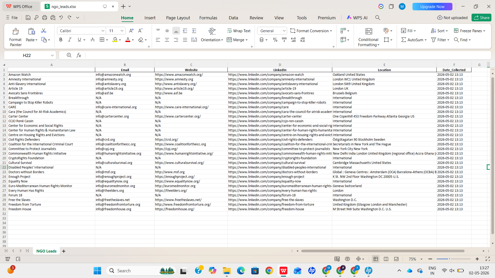

# 🚀 Lead Generation Automation

## 📌 Overview

This project is a Python-based automation script developed to perform **lead data collection and organization**.
It scrapes NGO data from a public source, processes the information, and stores it in a structured Excel format.

---

## 🎯 Objective

To build a simple and practical lead generation pipeline that:

* Collects real-world data
* Cleans and organizes it
* Stores it for further use

---

## ⚙️ Features

### ✅ Data Collection

* Scraped 30+ NGO records from a public website
* Extracted key fields:

  * Name
  * Website
  * Location

---

### ✅ Data Processing

* Generated additional fields:

  * Email (based on domain)
  * LinkedIn profile URL
* Structured the data into a clean tabular format

---

### ✅ Data Cleaning

* Removed duplicate entries
* Handled missing values using standard placeholders (N/A)
* Standardized fields for consistency

---

### ✅ Data Storage

* Automatically saved output to an Excel file (`ngo_leads.xlsx`)
* Organized columns for easy readability

---

## ⭐ Bonus Features

* Email format generation
* LinkedIn URL generation
* Optional scheduled automation support

---

## 🛠️ Tech Stack

* Python
* BeautifulSoup (Web Scraping)
* Pandas (Data Handling & Cleaning)
* OpenPyXL (Excel Export)

---

## 📂 Project Structure

```
lead_project/
│── script.py
│── ngo_leads.xlsx
│── output.png
│── README.md
```

---

## ▶️ How to Run

1. Install dependencies:

```
pip install pandas requests beautifulsoup4 openpyxl
```

2. Run the script:

```
python script.py
```

3. Output:

* Excel file will be generated automatically

---

## 📊 Output

* 30+ cleaned lead records
* Includes Name, Email, Website, LinkedIn, Location

---

## 📸 Sample Output



---

## 🧾 Approach

The script first scrapes NGO data from a public source using web scraping techniques.
It then processes the collected data, performs cleaning operations such as removing duplicates and handling missing values, and finally stores the structured data in an Excel file.
Additional features like email and LinkedIn generation were implemented to enhance usability.

---

## ✅ Conclusion

This project demonstrates a practical approach to automating lead generation using Python, combining data collection, cleaning, and storage into a simple workflow.
